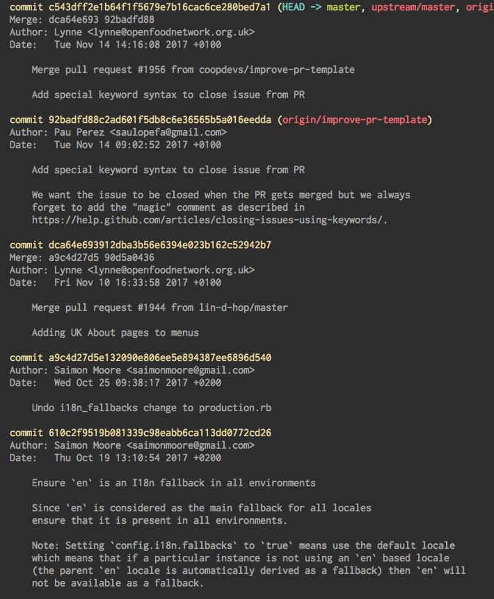

theme: Next, 3

# Fonaments de desenvolupament d'apps

[.footer: La Comunificadora]

---

## Pau Pérez

Desenvolupador a [Coopdevs](http://coopdevs.org/)


[@prez_pau](https://twitter.com/prez_pau)
[github.com/sauloperez](https://github.com/sauloperez)
[speakerdeck.com/sauloperez](speakerdeck.com/sauloperez)
[github.com/coopdevs](https://github.com/coopdevs)

---

# Com funcionen les apps a internet?


[.footer: Photo by Goh Rhy Yan on Unsplash]

---

## Client/Servidor


[.footer: Photo by Lan Pham on Unsplash]

---

### Client/Servidor

1. Servidor espera passiu
2. Client envia una petició
3. Client espera la resposta
4. Servidor processa i retorna resposta

---

## Frontend


[.footer: Photo by Norbert Levajsics on Unsplash]

---

## Frontend

* Navegador
* Interfície d'usuari


[.footer: Photo by Greg Rakozy on Unsplash]

---

### HTML + CSS = Estil

HTML

```HTML
<div class="row header">
  <h1>Katuma</h1>
  <h2 class="slogan">Compra directament a <span>productores agroecològiques de proximitat</span></h2>
</div>
```

---

### HTML + CSS = Estil

CSS

```CSS
.header {
    padding: 30px 0 0 50px;
}

h2 {
    font-size: 32px;
    font-weight: 300;
    margin-bottom: 40px;
}
```

---

### Javascript = Comportament

```javascript
if (calculator_select.attr('value') == original_calc_type) {
      $('.calculator-settings').show();
      $('#calculator-settings-warning').hide();
      $('.calculator-settings input').prop("disabled", false);
    } else {
      $('.calculator-settings').hide();
      $('#calculator-settings-warning').show();
      $('.calculator-settings input').prop("disabled", true);
    }
}
```

---

## Backend


[.footer: Photo by Dmitry Arslanov on Unsplash]

---

## Backend

* Servidor/s
* Lògica de negoci
* Dades


[.footer: Photo by Thomas Kvistholt on Unsplash]

---

### Aplicació

Implementa les operacions que permet el producte:

* Registrar usuari
* Realitzar compra
* Localitzar botiga

Retorna HTML, CSS, JS

---

### Aplicació

```ruby
def create
  @payment = @order.payments.build(object_params)

  if @payment.valid?
    @payment.source = CreditCard.find_by_id(params[:card])
    @payment.save
  end
end
```

---

### Base de dades

Opera sobre les dades

* SELECT
* INSERT
* UPDATE
* DELETE

---

### Base de dades

```sql
SELECT name
FROM users
WHERE email = ?;
```

---

## I els mòbils què?


[.footer: Photo by Antoine Barrès on Unsplash]

---

### ~~Navegador~~ App Nativa

* ~~HTML + CSS~~
* ~~JavaScript~~ 
*  Tecnologia nativa

---

### ~~Aplicació~~ API

Implementa les operacions que permet el producte:

* Registrar usuari
* Realitzar compra
* Localitzar botiga

Retorna ~~HTML, CSS, JS~~ dades => web **API**

---

## Com es fa tot això?

---

## Escrivint codi en _____*<br><br><br>\* Ruby, JS, PHP, Elixir, Rust, Java, Clojure, Bash, Haskell, C++...

---

> No reinventis la roda
-- Anònim


[.footer: Photo by Alice Achterhof on Unsplash]

---

## Reusant codi

1. Llibreria
2. Framework


---

## Git

Sistema distribuit de control de versions

* Commits
* Branques
* Repositoris



---

## Github

Plataforma de desenvolupament software

* Allotjament de repositoris
* Revisió del codi
* Gestió del projecte
* *Social coding*

---

## Anatomia d'un repositori


[.footer: Photo by Nino Liverani on Unsplash]

---

### Issue

---

### Pull Request

---

### Merge

---

### Fork

---

### Exemples

[RubyMoney/money](https://github.com/RubyMoney/money)
[coopdevs/timeoverflow](https://github.com/coopdevs/timeoverflow)
[departurerb/departure/](https://github.com/departurerb/departure)
[facebook/react-native](https://github.com/facebook/react-native)
[discourse/discourse](https://github.com/discourse/discourse)
[sindresorhus/awesome](https://github.com/sindresorhus/awesome)
[jondot/awesome-react-native](https://github.com/jondot/awesome-react-native)

---

## Activitats

---

### Analitza un repositori de software

Busca un repositori de software que t'interessi i analitza'l. Algunes coses que cal tenir en compte:

* Tipus de software: Llibreria, framework o app
* Filosofia de l'eina
* Dependències i requisits
* Com s'instal·la o arrenca
* Com s'hi pot contribuir

---

### *Brief* de desenvolupament de software

Redacta un *brief* pel teu projecte o per un que ja existeixi. Pots fer servir la [plantilla](https://github.com/sauloperez/fonaments_desenvolupament_apps/blob/master/plantilla_brief.md) inclosa als [recursos de la sessió](https://github.com/sauloperez/fonaments_desenvolupament_apps).

---

## Preguntes


[.footer: Photo by Matthias Heil on Unsplash]
